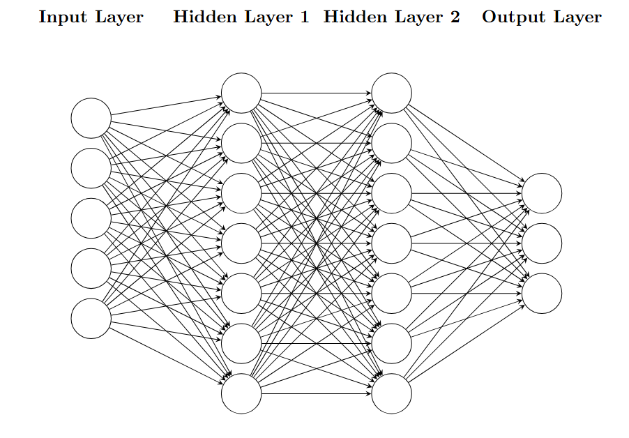

# Dense Multilayer Perceptron (MLP)

A **dense multilayer perceptron (MLP)** is a type of neural network composed of multiple layers of **perceptrons** (neurons). Each perceptron computes a weighted sum of its inputs, applies an activation function, and passes the result forward. By stacking layers of perceptrons, the network can learn **nonlinear relationships** between inputs and outputs.

---

## 1. How Predictions Are Made (The Forward Pass)

Predictions are made during the **forward pass** of the network. Data flows from the input layer, through the hidden layers, and finally to the output layer.

### 1.1 Input Layer

Each input feature $x_i$ is fed into the first layer.

### 1.2 Hidden Layers

For each layer $l$, the network performs two distinct operations:

- **Linear Transformation**  
  Each perceptron computes a weighted sum of the inputs from the previous layer, plus a bias term:

  $$z_j^{(l)} = \sum_i w_{ij}^{(l)} a_i^{(l-1)} + b_j^{(l)}$$

- **Activation**  
  The result is passed through a nonlinear activation function $\phi$. This output $a_j$ becomes the input for the next layer:

  $$a_j^{(l)} = \phi(z_j^{(l)})$$

### 1.3 Output Layer

This implementation **always uses multiple output nodes**, even for binary classification.

The final layer applies **SoftMax** to convert raw scores ($z$) into probabilities:

$$
\text{SoftMax}(z_k) = \frac{e^{z_k}}{\sum_{j} e^{z_j}}
$$

The class with the highest probability is selected as the prediction.

---

## 2. How It Learns (Backpropagation)

The learning process is driven by **Gradient Descent**, which updates the weights to minimize the loss function. However, to perform gradient descent, we need to know exactly how much each specific weight in the network contributed to the final error.

This is where **Backpropagation** comes in.

### The "Trick" of Backpropagation

Mathematically, finding the derivative of the loss function with respect to a weight deep inside the network is a massive application of the **Chain Rule**. Doing this naively for every weight individually would be computationally prohibitive.

Backpropagation is effectively a computational trick—specifically, **reverse-mode automatic differentiation**. Instead of calculating the derivative for each weight from scratch, it calculates the gradient for the final layer and propagates the "error signal" backward. By caching the results of the later layers, we can calculate the gradients for earlier layers using simple arithmetic, avoiding redundant calculations.

---

### The Math: Layer-by-Layer

We compute the gradient of the loss function $L$ with respect to any weight $w$ using the Chain Rule:

$$
\frac{\partial L}{\partial w} = \frac{\partial L}{\partial a} \cdot \frac{\partial a}{\partial z} \cdot \frac{\partial z}{\partial w}
$$

This process happens in three steps:

#### 1. Compute the Output Error

We compare the prediction to the actual target to find the error at the output layer.

#### 2. Propagate the Error Backward

We calculate an "error term" (often denoted as $\delta$) for layer $l$ by taking the error from the layer ahead ($l+1$) and multiplying it by the weights connecting them and the derivative of the activation function $\phi'$:

$$
\delta^{(l)} = \left( (w^{(l+1)})^T \delta^{(l+1)} \right) \odot \phi'(z^{(l)})
$$

This is the recursive "trick"—we use the error already computed for the deeper layer to solve the current layer.

#### 3. Update the Weights

Once we have the error term $\delta$ for a specific node, the gradient for the weight connecting to it is simply that error multiplied by the input coming into the node ($a^{(l-1)}$):

$$
\frac{\partial L}{\partial w_{ij}} = \delta_j^{(l)} \cdot a_i^{(l-1)}
$$

The weights are then updated using the learning rate $\eta$:

$$
w_{ij} \leftarrow w_{ij} - \eta \frac{\partial L}{\partial w_{ij}}
$$

---

## 3. Activation Functions

Activation functions introduce **nonlinearity** into the network. Without them, no matter how many layers you stack, the MLP would behave like a single linear regression model.

### ReLU (Rectified Linear Unit)

$$
\phi(z) = \max(0, z)
$$

- Computationally efficient  
- Induces sparsity  
- Avoids the "vanishing gradient" problem in deep networks  
- **Best for:** Hidden layers

### Sigmoid

$$
\phi(z) = \frac{1}{1 + e^{-z}}
$$

- Squashes output between 0 and 1  
- **Drawback:** Can cause gradients to vanish during backpropagation, stopping learning

### SoftMax

- Converts output scores into a probability distribution summing to 1  
- **Best for:** The final output layer in multi-class classification  
- **Recommended in this implementation**, since multiple output nodes are always used

---

## 4. Implementation Details

### Multiple Outputs

MLPs can be designed with **multiple output nodes**, making them suitable for **multi-class classification** problems.

In this specific implementation, **multiple output nodes are always used**, even for binary classification (e.g., `[Prob(Class 0), Prob(Class 1)]`). This is why **SoftMax** is the recommended final activation function.

### Regression Note

While MLPs can be used for **regression** (predicting continuous values) by using a **linear activation function** in the output layer, the current code in this package is designed for **classification only**.

---

## Summary

- **Forward Pass:** Data flows input → hidden → output to generate a prediction  
- **Backpropagation:** Error flows output → hidden → input. This uses the Chain Rule to efficiently compute how much each weight contributed to the error  
- **Activation Functions:** Essential for learning nonlinear complex patterns (ReLU for hidden layers, SoftMax for output)  

## Functionality of Implementation

The **Multilayer Perceptron (MLP)** implementation provides a flexible framework for building and training dense neural networks for classification. 

### Model Construction
- **Layer Specification**
  - Accepts either pre-built `DenseLayer` instances or tuples describing layer parameters.
  - Each layer can be configured with input size, output size, and activation function.
- **Customizable Loss Functions**
  - Supports pluggable loss functions.
  - Defaults to **Negative Log Likelihood** for classification tasks.
  - Allows user-defined loss functions for specialized use cases.

### Training
- **Gradient Descent Optimization**
  - Updates weights using backpropagation and gradient descent.
  - Configurable learning rate for fine-tuning convergence speed.
- **Training Modes**
  - **Batch Gradient Descent**: Updates weights after processing the entire dataset.
  - **Stochastic Gradient Descent (SGD)**: Updates weights after each sample for faster, noisier learning.
- **Early Stopping**
  - Optional `close_enough` threshold halts training when loss improvement becomes negligible.

### Prediction
- **Forward Pass**
  - Computes outputs by propagating inputs through all layers.
- **Label Selection**
  - Returns predicted class indices based on the highest probability.

### Practical Features
- **Verbose Mode**
  - Optionally prints loss updates during training for monitoring progress.
- **Caching**
  - Stores intermediate values (`last_input`, `last_z`) for efficient backpropagation.
- **Extensibility**
  - Modular design allows integration of custom activations, loss functions, or additional layers.
