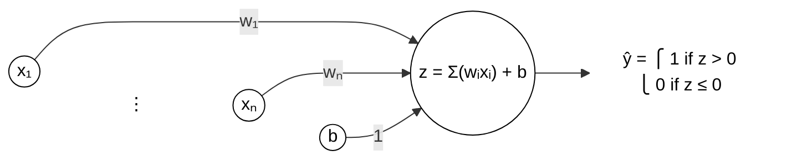

# Perceptron

A **perceptron** is a linear binary classifier that maps input features to an output decision. While simple, it serves as the fundamental building block for modern Neural Networks.

---

## The Mathematical Model

The perceptron is best understood using vector notation.

**Definitions:**
- **Inputs:** Vector $\mathbf{x} = [x_1, x_2, \dots, x_n]$
- **Weights:** Vector $\mathbf{w} = [w_1, w_2, \dots, w_n]$
- **Bias:** Scalar $b$ (shifts the decision boundary)

### 1. Weighted Sum (Pre-activation)
The perceptron computes the dot product of the inputs and weights, adding the bias:

$$
z = \mathbf{w} \cdot \mathbf{x} + b = \sum_{i=1}^{n} (w_i x_i) + b
$$

### 2. Activation Function (Heaviside Step)
It applies a hard threshold to determine the final output class:

$$
\hat{y} = 
\begin{cases} 
1 (\text{True}) & \text{if } z > 0 \\
0 (\text{False}) & \text{if } z \leq 0
\end{cases}
$$

---

## Visual Diagram

## Learning Algorithm (Update Rule)

The perceptron learns by adjusting weights **only** when it makes an incorrect prediction. We use a **Learning Rate** ($\eta$), a small hyperparameter (e.g., 0.01) to control the step size.

For each training example $(x, y)$, if the prediction $\hat{y} \neq y$:

1.  **Update Weights:**
    $$
    w_i \leftarrow w_i + \eta (y - \hat{y}) x_i
    $$

2.  **Update Bias:**
    $$
    b \leftarrow b + \eta (y - \hat{y})
    $$

> **Note:** If the prediction is correct ($y - \hat{y} = 0$), the weights remain unchanged.

---

## Critical Limitations 

1.  **Linear Separability (The XOR Problem):**
    The perceptron can **only** classify data that can be separated by a straight line (or hyperplane). It can solve **AND** or **OR** functions, but it fails completely on **XOR** (exclusive OR) data, which requires non-linear separation.

2.  **The Curse of Dimensionality:**
    As the number of input features ($x_1 \dots x_n$) increases:
    - Data becomes sparse (points are far apart in vector space).
    - The model becomes prone to **overfitting**; it easily finds a separator for training data that fails on real-world data.

3.  **Convergence Issues:**
    If the dataset is not linearly separable, the Perceptron Learning Algorithm (PLA) will **never converge**. It will oscillate endlessly between weights unless a maximum epoch limit is enforced.

---

## Stochastic vs. Batch Updates

| Update Type | Description | Pros | Cons |
| :--- | :--- | :--- | :--- |
| **Stochastic** | Updates weights after **each** training example. | Fast convergence; noise helps escape local minima. | Noisy updates lead to a zig-zag path toward the solution. |
| **Batch** | Updates weights after processing the **entire** dataset. | Stable convergence; smooth error gradient. | Slower per epoch; requires high memory to store gradients. |